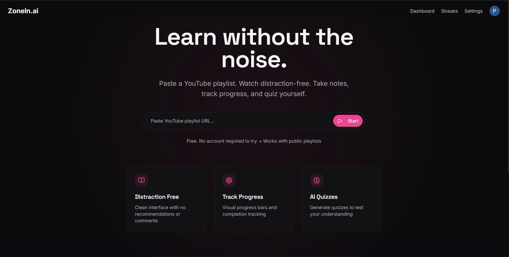
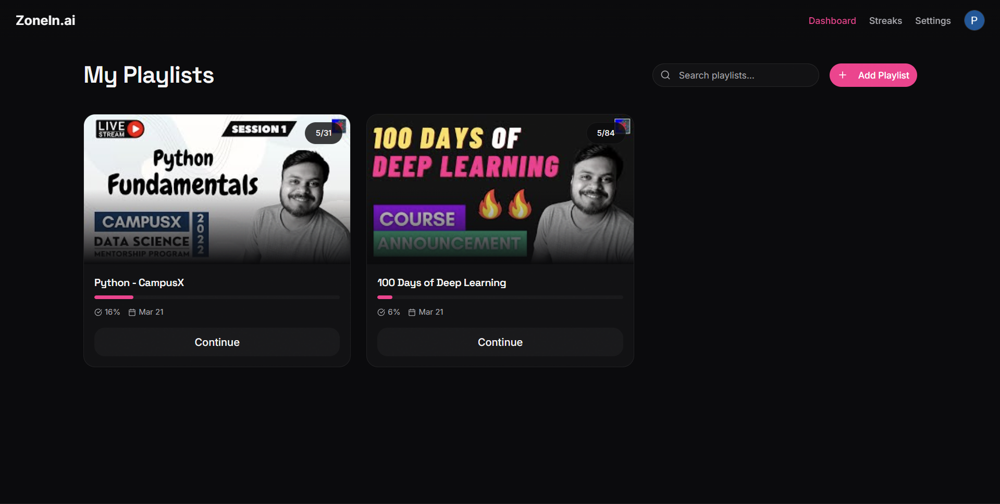
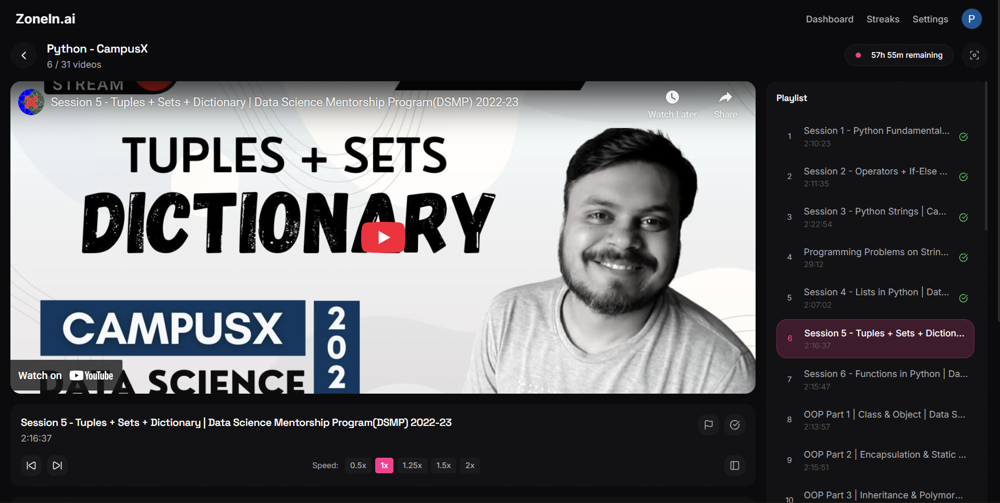
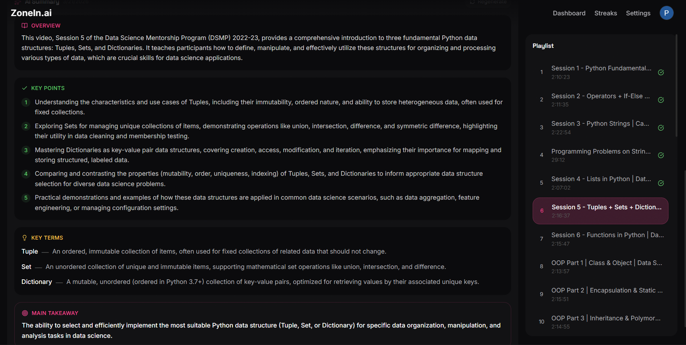
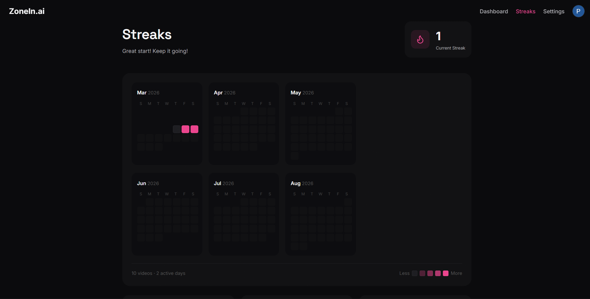

<div align="center">

# ZoneIn.ai

**Learn without the noise.**

Paste a YouTube playlist. Watch distraction-free. Take notes, get AI summaries, quiz yourself, and track your streak.

[](https://zone-in-ai.vercel.app)
[](https://react.dev)
[](https://typescriptlang.org)
[](https://firebase.google.com)
[](https://aistudio.google.com)



</div>

---

## The Problem

YouTube is an incredible learning resource — but it's designed to distract you. Recommendations, comments, and autoplay pull you away from what you came to learn. There's no way to track progress, take structured notes, or test your understanding — all in one place.

**ZoneIn.ai fixes this.**

---

## Features

- 🎬 **Distraction-free player** — no recommendations, no comments, no noise
- 🔍 **Focus Mode** — fullscreen, ESC to exit
- ✅ **Progress tracking** — mark videos complete, track X/Y per playlist
- 📝 **Timestamped notes** — notes tied to exact video moments, click to seek
- 🔗 **Resources tab** — save articles, docs, and links per video
- 🤖 **AI Summary** — Gemini generates overview, key points, and takeaways
- 🧠 **AI Quiz** — 12 questions per video to test your understanding
- 🔥 **Streak tracking** — 6-month activity heatmap, daily streak counter
- ☁️ **Cloud sync** — Google sign in, everything saved to Firestore

---

## Screenshots

| Dashboard | Player |
|---|---|
|  |  |

| AI Summary | Streaks |
|---|---|
|  |  |

---

## Tech Stack

| Category | Technology |
|---|---|
| Frontend | React 18 + TypeScript + Vite |
| Styling | Tailwind CSS + shadcn/ui |
| Animation | GSAP |
| Auth | Firebase Authentication (Google) |
| Database | Firebase Firestore |
| AI | Google Gemini 2.5 Flash |
| Video | YouTube Data API v3 + IFrame API |
| Deployment | Vercel |

---

## System Architecture

```
┌─────────────────────────────────────────────────┐
│                  ZoneIn.ai                      │
│               React + TypeScript                │
└──────────┬───────────────────┬──────────────────┘
           │                   │
┌──────────▼──────┐   ┌────────▼───────────┐
│  Firebase Auth  │   │  YouTube Data API  │
│  Google Sign In │   │  Playlist fetching │
└──────────┬──────┘   └────────┬───────────┘
           │                   │
┌──────────▼───────────────────▼───────────┐
│           Firebase Firestore              │
│  users · playlists · videos · notes      │
│  resources · ai_summaries · activities   │
└───────────────────────────────────────────┘
           │
┌──────────▼──────────────────┐
│      Google Gemini API      │
│  AI Summaries + AI Quizzes  │
└─────────────────────────────┘
```

---

## Project Structure

```
src/
├── components/
│   ├── player/
│   │   ├── NotesPanel.tsx        # Timestamped notes
│   │   ├── ResourcesPanel.tsx    # Save links & articles
│   │   ├── AISummaryPanel.tsx    # Gemini AI summary
│   │   └── QuizPanel.tsx         # Gemini AI quiz
│   └── ui/                       # shadcn/ui components
├── sections/
│   ├── HeroSection.tsx           # Landing page
│   ├── DashboardSection.tsx      # Playlist library
│   ├── PlayerSection.tsx         # Main watch screen
│   ├── StreaksSection.tsx         # Activity heatmap
│   └── SettingsSection.tsx       # User settings
├── contexts/
│   └── AuthContext.tsx           # Firebase auth state
├── hooks/
│   ├── useStreak.ts              # Streak logic
│   └── useDebounce.ts            # Auto-save debounce
└── lib/
    ├── firebase.ts               # Firestore operations
    ├── youtube.ts                # YouTube API helpers
    └── claude.ts                 # Gemini quiz generation
```

---

## Local Setup

### Prerequisites
- Node.js 18+
- Firebase project with Auth + Firestore enabled
- YouTube Data API v3 key
- Gemini API key from [aistudio.google.com](https://aistudio.google.com)

### Steps

```bash
# 1. Clone the repo
git clone https://github.com/Prathamesh-Gitprofile/ZoneIn-ai.git
cd ZoneIn-ai

# 2. Install dependencies
npm install

# 3. Create .env file
cp .env.example .env
# Fill in your API keys

# 4. Start dev server
npm run dev
```

### Environment Variables

```env
VITE_FIREBASE_API_KEY=
VITE_FIREBASE_AUTH_DOMAIN=
VITE_FIREBASE_PROJECT_ID=
VITE_FIREBASE_STORAGE_BUCKET=
VITE_FIREBASE_MESSAGING_SENDER_ID=
VITE_FIREBASE_APP_ID=
VITE_YOUTUBE_API_KEY=
VITE_GEMINI_API_KEY=
```

> **Note:** Add `localhost` to Firebase authorized domains and create the required Firestore composite indexes on first run.

---

## Deployment

Deployed on **Vercel**. Any push to `main` triggers an automatic redeploy.

Add all environment variables in Vercel → Settings → Environment Variables, and add your Vercel domain to Firebase authorized domains.

---

<div align="center">

Built by [Prathamesh](https://github.com/Prathamesh-Gitprofile) 

</div>
